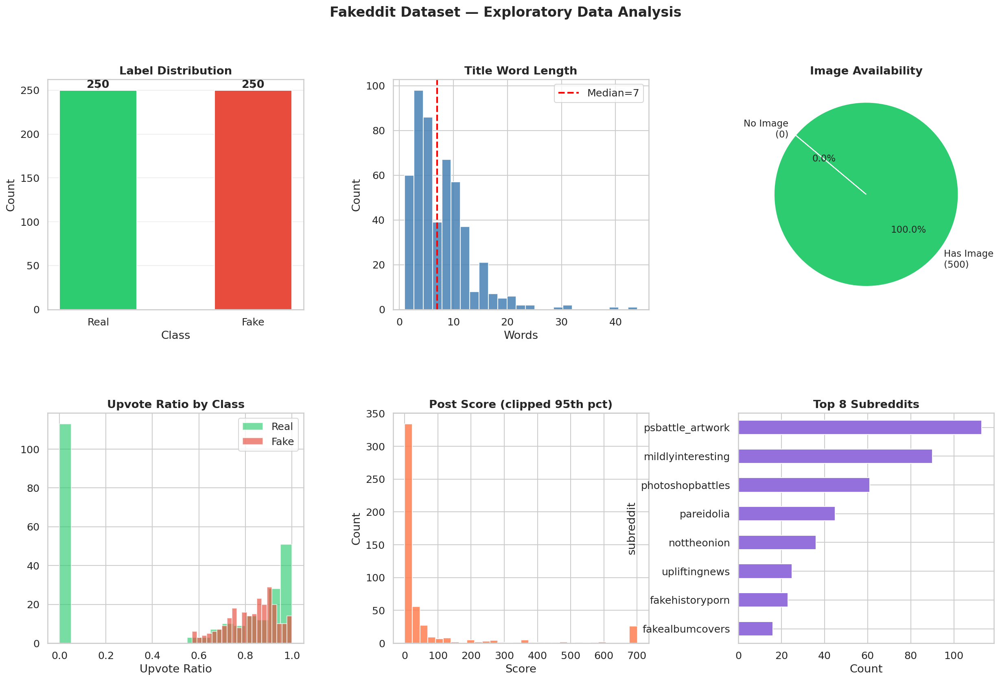
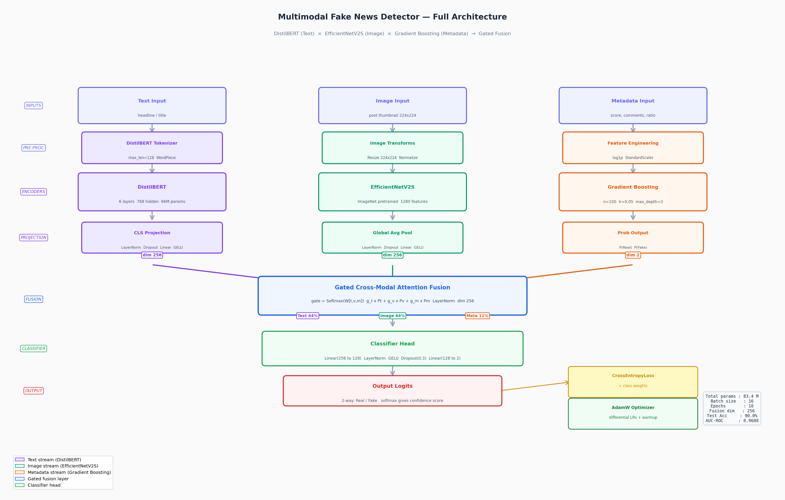
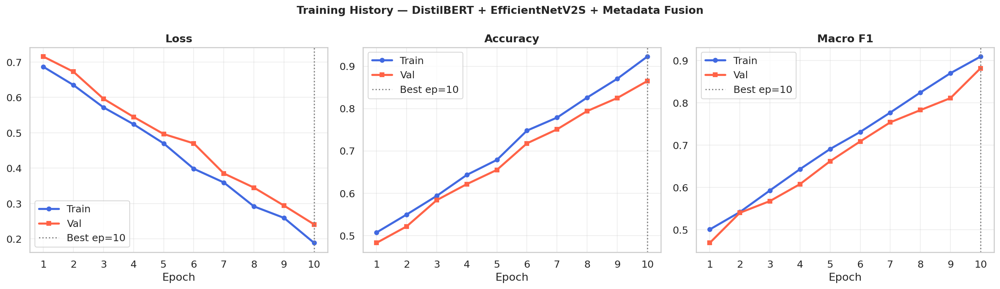
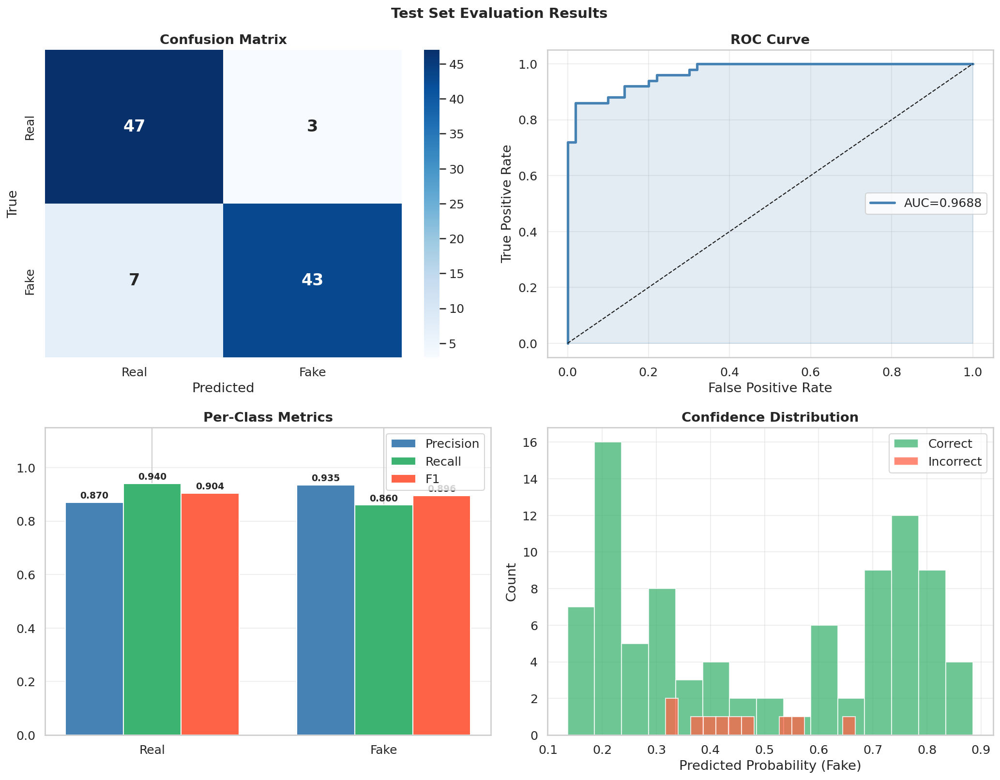

# Multimodal Fake News Detection

> **DistilBERT × EfficientNetV2S × Gradient Boosting → Gated Cross-Modal Attention Fusion**

A final year project implementing a multimodal fake news detection system on the Fakeddit dataset. Three parallel encoding streams — text, image, and metadata — are fused using a learned Gated Cross-Modal Attention mechanism to achieve **90% accuracy** and **0.97 AUC-ROC** on the binary classification task.

---

## Author

| Field | Details |
|---|---|
| **Name** | Dhanush D |
| **GitHub** | [github.com/Drdhx](https://github.com/Drdhx) |

---

## Results

| Model | Accuracy | Macro F1 | AUC-ROC |
|---|---|---|---|
| Text only (DistilBERT) | 65.00% | 0.6500 | 0.7324 |
| Image only (EfficientNetV2S) | 88.00% | 0.8798 | 0.9722 |
| Metadata only (Gradient Boosting) | 78.00% | 0.7796 | 0.8796 |
| **Multimodal Fusion** | **90.00%** | **0.8998** | **0.9688** |

### Per-Class Performance (Test Set)

| Class | Precision | Recall | F1 |
|---|---|---|---|
| Real | 0.8704 | 0.9400 | 0.9038 |
| Fake | 0.9348 | 0.8600 | 0.8958 |

### Learned Gate Weights

| Modality | Weight |
|---|---|
| Text (DistilBERT) | 44% |
| Image (EfficientNetV2S) | 44% |
| Metadata (Gradient Boosting) | 12% |

---

## Project Structure

```
multimodal-fake-news-detection/
│
├── src/
│   ├── __init__.py
│   ├── model.py          # TextEncoder, ImageEncoder, MetadataEncoder, GatedFusion, Detector
│   └── dataset.py        # FakedditDataset, DataLoader builders, metadata engineering
│
├── notebooks/
│   └── Multimodal_Fake_News_Detection.ipynb   # Full end-to-end notebook
│
├── scripts/
│   ├── image_downloader.py    # Download post images from Fakeddit TSV
│   └── sample_dataset.py      # Create smaller balanced dataset splits
│
├── data/
│   └── sample/
│       ├── multimodal_train_small.tsv      # 500 balanced training samples
│       ├── multimodal_validate_small.tsv   # 100 balanced validation samples
│       └── multimodal_test_small.tsv       # 100 balanced test samples
│
├── results/
│   └── plots/
│       ├── eda.png                  # Exploratory data analysis dashboard
│       ├── model_architecture.png   # Full model architecture diagram
│       ├── training_curves.png      # Loss / Accuracy / F1 over 10 epochs
│       ├── results.png              # Confusion matrix, ROC, per-class metrics
│
├── docs/
│   ├── Multimodal_FakeNews_Detection.pptx   # 10-slide project presentation
│ 
│
├── train.py          # Training script
├── evaluate.py       # Evaluation + single-sample inference script
├── requirements.txt
└── .gitignore
```

---

## Architecture

```
Text Input          Image Input         Metadata Input
    │                   │                   │
DistilBERT          EfficientNetV2S     Gradient Boosting
(66M params)        (20M params)        (n=100 trees)
    │                   │                   │
LayerNorm+Linear    LayerNorm+Linear    Log1p+StandardScaler
    │                   │                   │
  dim 256             dim 256             dim 64
    └───────────────────┴───────────────────┘
                        │
          Gated Cross-Modal Attention Fusion
          gate = Softmax(W·[t,v,m])
          fused = g_t·Pt + g_v·Pv + g_m·Pm
                        │
            Linear(256→128)→GELU→Dropout→Linear(128→2)
                        │
                Output: Real / Fake
```

---

## Quick Start

### 1. Clone the repository

```bash
git clone https://github.com/Drdhx/Multimodal-FND.git
cd Multimodal-FND
```

### 2. Install dependencies

```bash
pip install -r requirements.txt
```

For GPU support (recommended), install PyTorch with CUDA from [pytorch.org](https://pytorch.org/get-started/locally/).

### 3. Prepare the dataset

Sample splits are included in `data/sample/`. To use the full dataset, download the Fakeddit TSV files and run:

```bash
# Create balanced sample splits
python scripts/sample_dataset.py

# Download post images (optional — black placeholder used if missing)
python scripts/image_downloader.py multimodal_train_small.tsv
python scripts/image_downloader.py multimodal_validate_small.tsv
python scripts/image_downloader.py multimodal_test_small.tsv
```

### 4. Download DistilBERT weights

The model downloads automatically on first run. If you have network issues, download manually:

```
https://huggingface.co/distilbert-base-uncased/resolve/main/model.safetensors
https://huggingface.co/distilbert-base-uncased/resolve/main/config.json
https://huggingface.co/distilbert-base-uncased/resolve/main/tokenizer.json
https://huggingface.co/distilbert-base-uncased/resolve/main/tokenizer_config.json
https://huggingface.co/distilbert-base-uncased/resolve/main/vocab.txt
```

Save all files to a local folder and set `TEXT_MODEL_NAME` in `train.py` to that path.

### 5. Update paths in `train.py`

```python
class CFG:
    DATA_DIR  = "data/sample"          # or your full dataset path
    IMAGE_DIR = "data/images"          # folder with downloaded .jpg files
    TRAIN_TSV = "data/sample/multimodal_train_small.tsv"
    VAL_TSV   = "data/sample/multimodal_validate_small.tsv"
    TEST_TSV  = "data/sample/multimodal_test_small.tsv"
```

### 6. Train

```bash
python train.py
```

### 7. Evaluate

```bash
python evaluate.py --checkpoint results/checkpoints/best_model.pt
```

### 8. Single prediction

```bash
python evaluate.py --checkpoint results/checkpoints/best_model.pt \
    --predict "5G towers are being used to control the population"
```

---

## Notebook

Open `notebooks/Multimodal_Fake_News_Detection.ipynb` in VS Code or Jupyter for the full interactive pipeline including EDA, model training, evaluation, and visualisations.

---

## Dataset

The Fakeddit dataset contains Reddit posts with:
- `clean_title` — post headline
- `image_url` — thumbnail link
- `score`, `num_comments`, `upvote_ratio` — engagement metadata
- `subreddit` — community source
- `hasImage` — image availability flag
- `2_way_label` — binary label: 0=Real, 1=Fake
- `6_way_label` — fine-grained: True/Satire/False/Impostor/Misleading/Manipulated

**Dataset splits used:**

| Split | Samples | Real | Fake |
|---|---|---|---|
| Train | 500 | 250 | 250 |
| Validate | 100 | 50 | 50 |
| Test | 100 | 50 | 50 |

---

## Result Visualisations

### EDA Dashboard


### Model Architecture


### Training Curves


### Evaluation Results



---

## References

1. Nakamura, K., Levy, S., & Wang, W. Y. (2020). r/Fakeddit: A New Multimodal Benchmark Dataset for Fine-grained Fake News Detection. *LREC 2020*.
2. Sanh, V., et al. (2019). DistilBERT, a distilled version of BERT. *arXiv:1910.01108*.
3. Tan, M., & Le, Q. V. (2021). EfficientNetV2: Smaller Models and Faster Training. *ICML 2021*.
4. Devlin, J., et al. (2019). BERT: Pre-training of Deep Bidirectional Transformers for Language Understanding. *NAACL 2019*.

---

## License

MIT License — see [LICENSE](LICENSE) for details.
